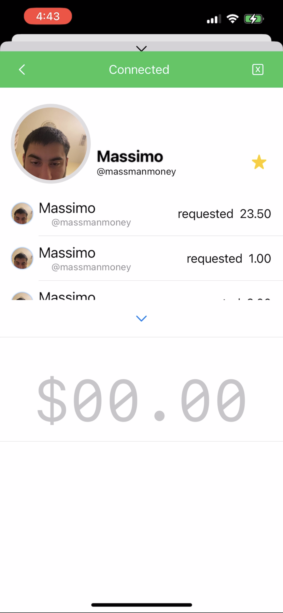
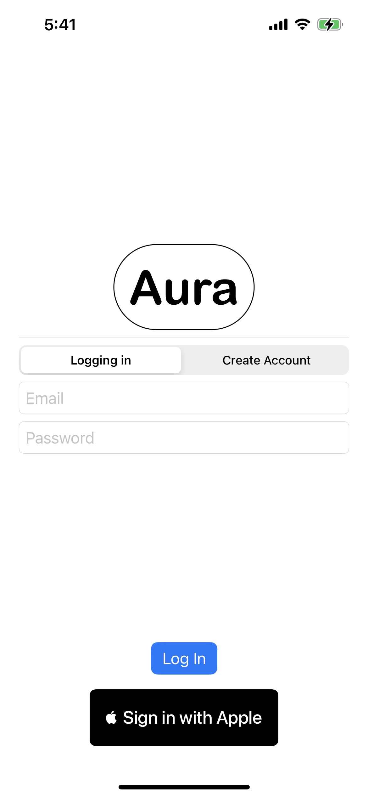
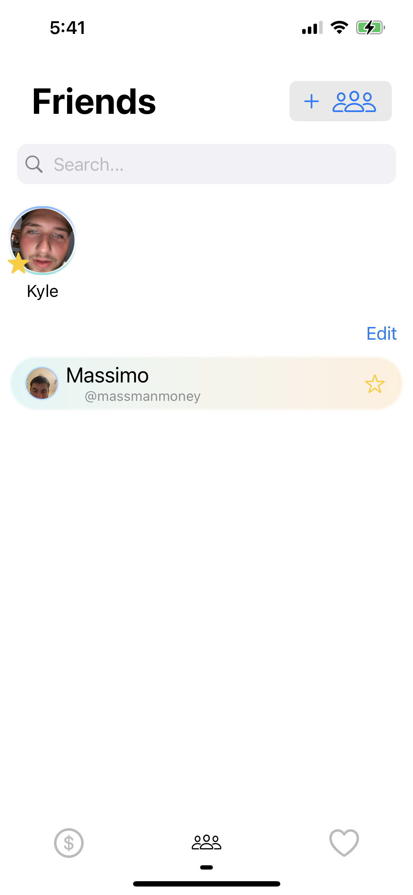
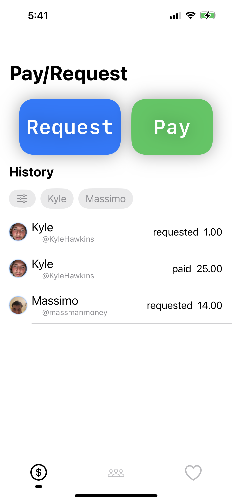
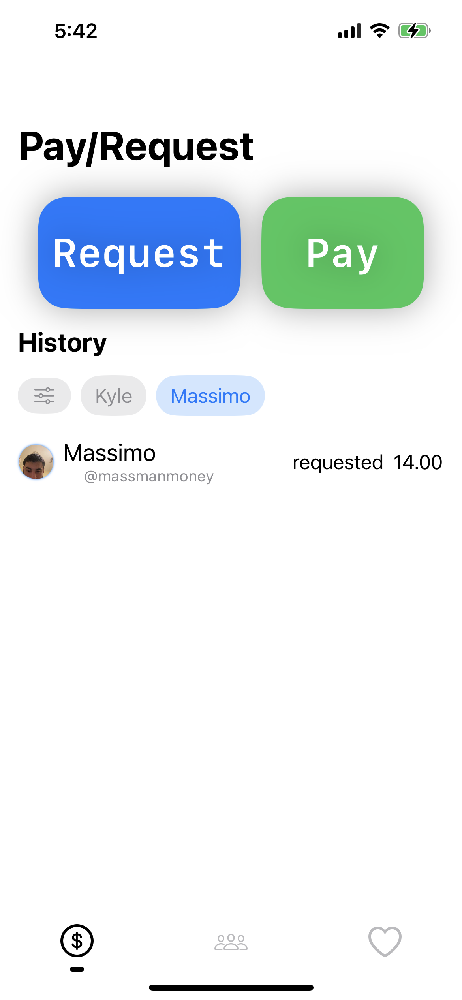

# Readme

## Kamyar Mirfakhraie
### Email me for access to this code: 
- kamyar_mirfakhraie@brown.edu 
- kamyar.mirf@gmail.com

### This project aims to demonstrate the viability of using existing bluetooth frameworks for the purposes of digital payments (P2P, mobile payments).

## (Work in progress) Screenshots
### Functionality so far includes:
- persisted data via MongoDB Realm (and device sync capability allows for persistence across devices for individual accounts)
- Non-bluetooth payment flow in friends tab (adds to history -> swipe left action for accessing receipt view)
- filtering of friends and best friends via search bar
- filtering of history in order of most transacted with -> allows for multiple selections of people in history
- favorited businesses bring up view with closest locations
- ability to favorite and unfavorite friends as well as remove them entirely (via edit button or via designated remove button in each friend view)
- and more

